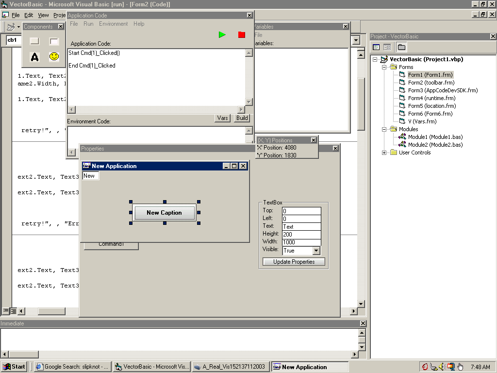



## Visual Scripting Language \!\*UPDATE\*\!

### Description

Hey! Peter told me i could take over the release of this code, so I am! Now you can drag objects around, and they have the little size boxes... for now only the command button can be sized and drug around... ill fix that.. this is ALLL messed up... i dont have the time to finish it... As you look at the code youll see i tryed to make it so each control had its ow options, but failed... i donno what to do with it :'(... Anyway, im submitting this because the first time i saw this code a long time ago, i wished i could drag stuff around like VB.. and recently i decided to make it work! Please leave feedback!
 
### More Info
 

             |
---                |---
**Submitted On**   |2003-09-27 07:46:42
**By**             |[Jesse Seidel \(Dr\. Fire\)](https://github.com/Planet-Source-Code/PSCIndex/blob/master/ByAuthor/jesse-seidel-dr-fire.md)
**Level**          |Advanced
**User Rating**    |3.0 (12 globes from 4 users)
**Compatibility**  |VB 6\.0
**Category**       |[Complete Applications](https://github.com/Planet-Source-Code/PSCIndex/blob/master/ByCategory/complete-applications__1-27.md)
**World**          |[Visual Basic](https://github.com/Planet-Source-Code/PSCIndex/blob/master/ByWorld/visual-basic.md)
**Archive File**   |[Visual\_Scr1651069272003\.zip](https://github.com/Planet-Source-Code/jesse-seidel-dr-fire-visual-scripting-language-update__1-48834/archive/master.zip)

